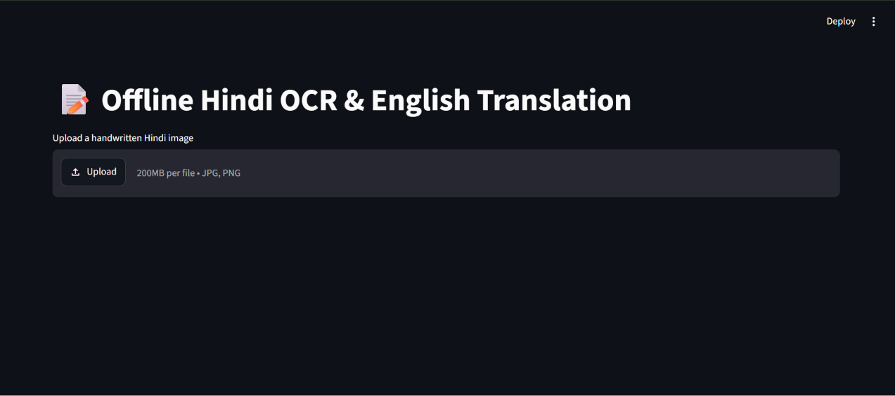
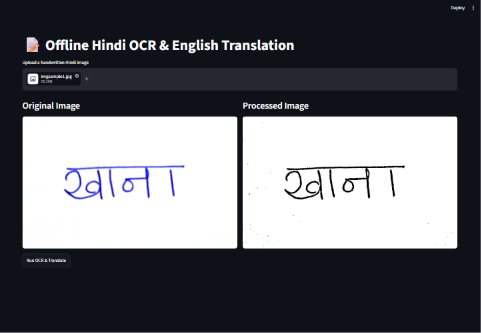
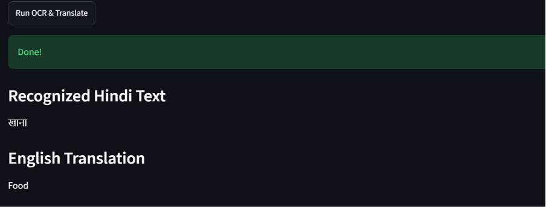
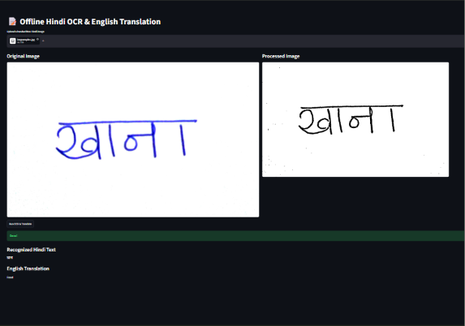

# 📝 Offline Handwritten Hindi OCR and English Translation using OpenCV, Tesseract OCR and Hugging Face Transformers


An AI-powered application that extracts handwritten Hindi text from an image using OCR and translates it into English using a Transformer-based Neural Machine Translation model.

This project demonstrates the integration of Computer Vision, Optical Character Recognition (OCR), Natural Language Processing (NLP), and an interactive web interface into a single end-to-end application.

---

## 🚀 Features

- 📷 Upload handwritten Hindi image
- 🖼️ Image preprocessing using OpenCV
- 🔍 Offline Hindi OCR using Tesseract
- 🌐 Hindi → English translation using Hugging Face Transformers
- 💻 Interactive Streamlit interface
- ⚡ Modular and reusable code structure
- 🔒 Fully offline inference after model download

---

## 📌 Problem Statement

Handwritten Hindi documents are difficult to digitize due to variations in writing styles and complex Devanagari characters.

This project aims to convert handwritten Hindi words into machine-readable Hindi text using OCR and subsequently translate the extracted text into English using a Transformer-based translation model.

---

# 🏗️ System Architecture

```
                    Handwritten Hindi Image
                               │
                               ▼
                 OpenCV Image Preprocessing
                               │
                               ▼
                   Tesseract OCR (Hindi)
                               │
                        Hindi Text Output
                               │
                               ▼
      Hugging Face Transformer (Hindi → English)
                               │
                               ▼
                     English Translation
                               │
                               ▼
                     Streamlit User Interface
```

---

# 📂 Project Structure

```
HINDI_TO_ENG/

│── uploads/
│── outputs/
│── screenshots/

│── preprocessing.py
│── ocr.py
│── translate.py
│── app.py

│── requirements.txt
│── README.md
│── .gitignore
```

---

# 🛠️ Technologies Used

| Technology | Purpose |
|------------|---------|
| Python | Programming Language |
| OpenCV | Image preprocessing |
| Tesseract OCR | Offline Hindi text recognition |
| Hugging Face Transformers | Hindi → English Translation |
| Helsinki-NLP OPUS-MT | Neural Machine Translation |
| Pillow | Image Processing |
| Streamlit | Web Application |
| Git | Version Control |

---

# ⚙️ Installation

## Clone Repository

```bash
git clone https://github.com/Dishabhandari-ai/HINDI_TO_ENG.git

cd HINDI_TO_ENG
```

---

## Create Virtual Environment

### Windows

```bash
python -m venv venv
```

Activate

```bash
venv\Scripts\activate
```

---

## Install Dependencies

```bash
pip install -r requirements.txt
```

---

## Install Tesseract OCR

Download Tesseract OCR from

https://github.com/UB-Mannheim/tesseract/wiki

Install the Hindi language pack (`hin.traineddata`) and update the path in `ocr.py` if required.

---

# ▶️ Running the Application

Start the Streamlit application

```bash
streamlit run app.py
```

The application will open automatically in your browser.

---

# 🖥️ Workflow

1. Upload a handwritten Hindi image.
2. The image is preprocessed using OpenCV.
3. OCR extracts Hindi text from the image.
4. The extracted Hindi text is translated into English.
5. Results are displayed in the Streamlit interface.

---

## Home Screen



---

## Uploaded Image



---

## Processed Image


---


## Translation Result



---

## Complete Pipeline



# 📊 Example

### Input Image

```
राम
```

↓

### OCR Output

```
राम
```

↓

### English Translation

```
Ram
```

---

# 💡 Challenges Faced

- Recognition of handwritten Hindi text is significantly more challenging than printed text.
- Image quality, handwriting style, and lighting conditions greatly influence OCR accuracy.
- Selecting an OCR model suitable for offline handwritten Hindi recognition required experimentation and evaluation.

---

# ⚠️ Current Limitations

- Optimized for isolated handwritten Hindi words.
- Recognition accuracy decreases for cursive handwriting.
- Multi-line handwritten paragraphs are not currently supported.
- OCR performance depends on image quality.

---

# 🔮 Future Improvements

- Support handwritten Hindi sentences and documents.
- Integrate Transformer-based OCR models for improved handwriting recognition.
- Add support for additional Indian languages.
- Export translated text to PDF and DOCX.
- Deploy the application using Docker and cloud services.
- Improve OCR accuracy using advanced image enhancement techniques.

---

# 📚 Learning Outcomes

This project demonstrates practical implementation of:

- Computer Vision
- Optical Character Recognition
- Transformer-based Neural Machine Translation
- Hugging Face Ecosystem
- Image Processing
- Python Application Development
- Modular Software Design
- Version Control with Git

---

# 👨‍💻 Author

DISHA BHANDARI

Engineering Student

GitHub: https://github.com/Dishabhandari-ai


---

# ⭐ If you found this project useful, consider giving it a star.